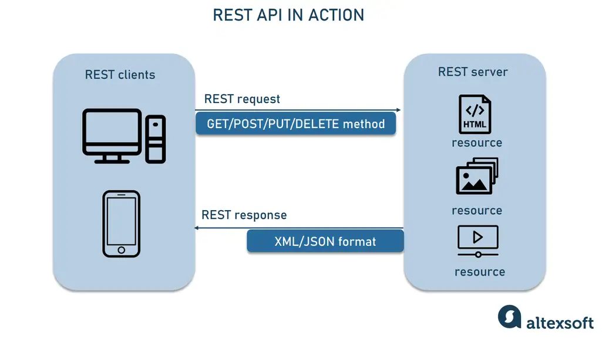
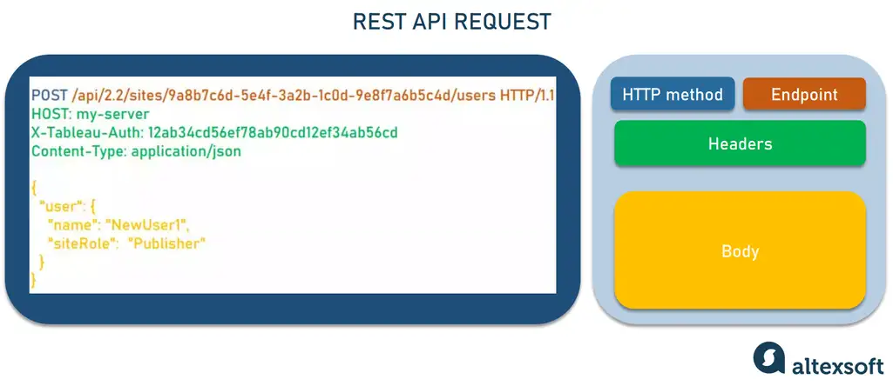
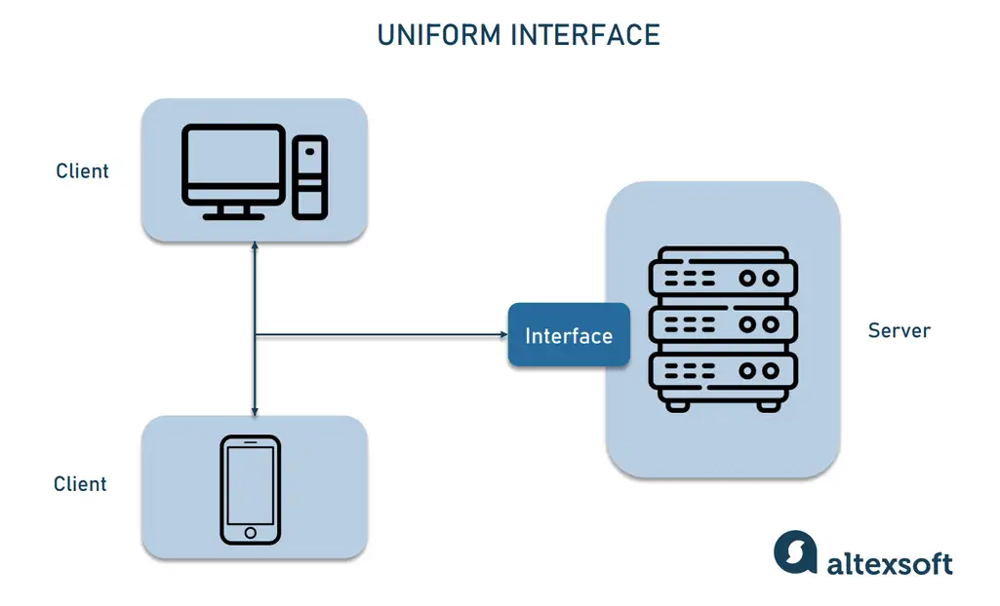
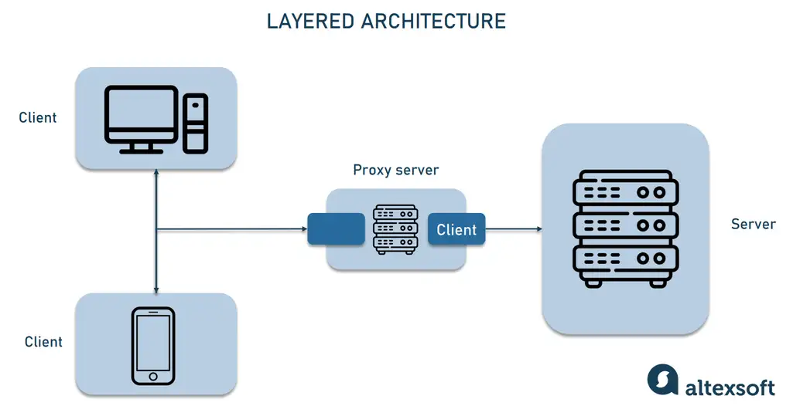

Basic example of REST API using springboot

----------------------
What is REST API and how does it work
REST is short for Representational State Transfer, an architectural style for building web services that interact via an HTTP protocol. Its principles were formulated in 2000 by computer scientist Roy Fielding and gained popularity as a scalable and flexible alternative to older methods of machine-to-machine communication. It still remains the gold standard for public APIs.

rest_api_works
A REST client can interact with each resource by sending an HTTP request.

REST API concepts
The key elements of the REST API paradigm are
a client or software that runs on a user’s computer or smartphone and initiates communication;
a server that offers an API as a means of access to its data or features; and
a resource, which is any piece of content that the server can provide to the client (for example, a video or a text file).
To get access to a resource, the client sends an HTTP request. In return, the server generates an HTTP response with encoded data on the resource. Both types of REST messages are self-descriptive, meaning they contain information on how to interpret and process them.
REST API methods and request structure
Any REST request includes four essential parts: an HTTP method, an endpoint, headers, and a body.

An HTTP method describes what is to be done with a resource. There are four basic methods also named CRUD operations:
POST to Create a resource,
GET to Retrieve a resource,
PUT to Update a resource, and
DELETE to Delete a resource.
An endpoint contains a Uniform Resource Identifier (URI) indicating where and how to find the resource on the Internet. The most common type of URI is a Unique Resource Location (URL), serving as a complete web address.

Headers store information relevant to both the client and server. Mainly, headers provide authentication data — such as an API key, the name or IP address of the computer where the server is installed, and the information about the response format.

A body is used to convey additional information to the server. For instance, it may be a piece of data you want to add or replace.

REST response structure
In response, the server sends not the sought-for resource itself, but its representation — a machine-readable description of its current state. The same resource can be represented in different formats, but the most popular ones are XML and JSON.

Whenever relevant, a server includes in the response hyperlinks or hypermedia that links to other related resources. This way, the server gives instructions on what the client can do next and what further requests it can make.

REST best practices: what makes an API RESTful
REST isn’t linked to any particular technology or platform. Nor does it dictate exactly how to build an API. Instead, it introduces best practices known as constraints. They describe how the server processes requests and responds to them. Operating within these constraints, the system gains desirable properties.
Client-server autonomy
Properties gained: modifiability, better system reliability

In the REST API system, the client and server work independently, using different tech stacks. The client doesn’t need to know anything about business logic, while the server has no idea about the user interface. The separation of responsibilities means that API providers and API consumers can be modified and it won’t backfire on their communication.
Uniform interface
Properties gained: ease of use, shared understanding

A uniform interface is a key attribute that distinguishes REST APIS from non-REST APIs. It dictates a standardized way to communicate with a given server, no matter the client app or device that runs it. We already mentioned some fundamentals supporting this practice, which are
a unique identifier (URI) assigned to each resource,
self-descriptive messages explaining how to interpret them and what to do next,
the ability to manipulate a resource through its representation in JSON or XML, and
hypermedia linking to related resources.

Layered architecture
Properties gained: improved system scalability and security

The RESTful system has a layered structure in which each layer works independently and interacts only with the layers directly connected to it. When calling a server, a client doesn’t know whether there are any intermediaries along the way.

Due to the layered architecture, you can place a proxy or load balancer between the client and server and thus improve scalability. Adding security as a separate layer enhances system safety. Although these services are involved in producing the response, the client doesn’t have to worry about what’s behind the interface.

Caching
Properties gained: low server latency, increase in app speed and responsiveness

REST APIs allow clients to store frequently accessed data on their side instead of requesting them again and again. As a result, the app makes fewer calls, which reduces the load on the server and its latency. In turn, the application becomes more responsive and reliable.
Stateless interactions
Properties gained: enhanced performance, app reliability

The word stateless indicates that an API doesn’t store any information related to the previous sessions, treating each request independently. All data on the current client’s state is contained in the request body.

Being stateless, REST APIs don’t have to deal with the server-side state synchronization logic. Another advantage of session independence is that any server can process requests. This improves the performance of the application and reduces the risk of going down.

